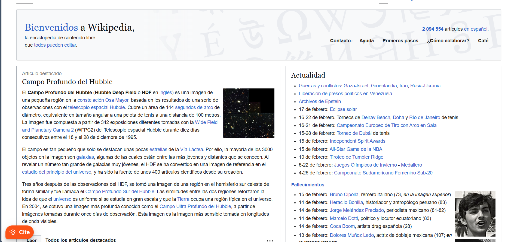
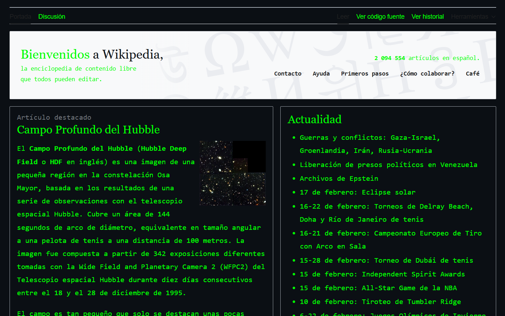

# ERROR:404 – Styling & Ricing Web Laboratory

This project was developed for the course *Tecnologías y Sistemas Web* and corresponds to **Laboratory 2**, which is divided into two independent parts:

1. Ricing a public web page (Wikipedia) using custom CSS  
2. Styling an interactive story created in Laboratory 1 using CSS  

Both parts focus on improving visual design and user experience through CSS, while running locally on Nginx.

## Part 1: Ricing Wikipedia

In the first part of the laboratory, a **ricing exercise** was performed on Wikipedia using a custom CSS style.

### Description

- Wikipedia was visually modified using a Matrix-inspired aesthetic  
- Typography, background colors, and contrast were adjusted  
- The goal was to demonstrate how CSS can completely transform the appearance of an existing website  

This part was done **only for styling purposes** and is independent from the interactive story.

### Before and After – Wikipedia Ricing

**Before (Original Wikipedia):**

**After (Wikipedia with Matrix-style CSS):**

## Part 2: Interactive Story Styling (Lab 1 Extension)

The second part of the laboratory focuses on improving the interactive story created in **Laboratory 1**.

### Project Structure

- `index.html` – Main entry point of the story  
- `css/style.css` – Custom CSS applied to all pages  
- `assets/img/` – Images used throughout the story  
- `README.md` – Project documentation  

All HTML files are located at the root of the project to simplify routing.

## About the Story

The story follows a user who finds an old computer that suddenly turns on and displays mysterious options on the screen.  
Each decision represents a different path and leads to one of three possible endings:

- **Good ending** – The system is restored  
- **Neutral ending** – Nothing changes  
- **Bad ending** – The system fails  

The visual style was designed to match the narrative tone of mystery and technology.

## Styling Requirements Implemented

The following requirements from the laboratory were implemented:

1. A consistent visual style across the entire story  
2. Custom typography related to a terminal / retro computer experience  
3. Different background colors for:
   - Start page  
   - Choice pages  
   - Final pages  
4. Button hover animations using CSS pseudoclasses  
5. Images framed and resized with visual intention  
6. Navigation options styled as clear dialogue-style buttons  
7. The project runs entirely on a local Nginx server  

No JavaScript was used.

## Navigation

Each page contains:

- Short narrative text  
- At least one image  
- Two buttons representing user choices  
- Header, body, and footer structure  

Navigation is handled exclusively through HTML links.

## How to Run Locally

To view the project using Nginx, follow these steps:

1. Create the project directory inside the Nginx web root:
   sudo mkdir -p /var/www/html/adventure
   
2. Copy all HTML files to the root of the project directory:
  sudo cp *.html /var/www/html/adventure/
  The index.html file must be located at this level.

3. Copy the assets folder (images) into the same directory:
  sudo cp -r assets /var/www/html/adventure/

4. Copy the css folder containing style.css into the same directory:
  sudo cp -r css /var/www/html/adventure/

5. Set proper permissions to ensure Nginx can access the files:
  sudo chown -R www-data:www-data /var/www/html/adventure
  sudo chmod -R 755 /var/www/html/adventure

6. Open the project in a web browser:
  http://localhost/adventure/index.html

## Technologies Used

- HTML  
- CSS  
- Nginx web server  
- WSL (Linux environment on Windows)

## Author

- Student: Miguel Rosas – 241274  
- Course: Tecnologías y Sistemas Web  
- Year: 2026  

## Video

Video demonstration:  
[https://youtu.be/VSkZIADQQ5A](https://youtu.be/JLXzVRZxpug)
